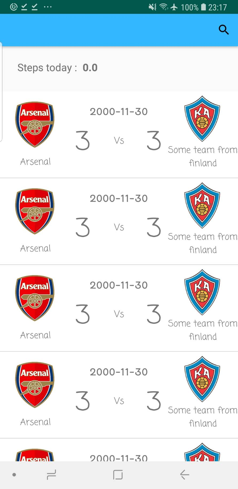
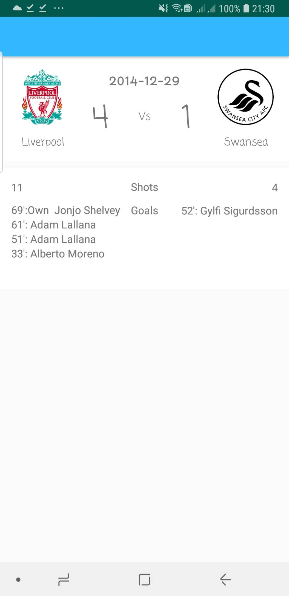
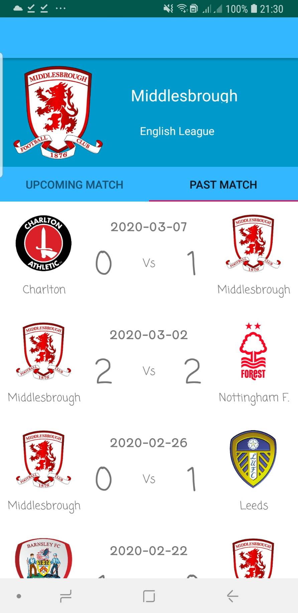
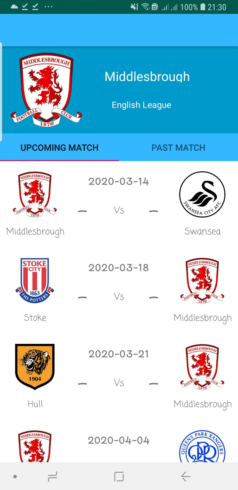

# IF3210-2020-12-BolaSepak

Tugas Besar IF3210 - 2020 - Kelompok 12
Android : Bola Sepak

## Deskripsi Aplikasi
Fitur utama dari BolaSepak adalah memberikan schedule pertandingan sepak bola yang akan datang, dan juga yang sudah lewat. Selain schedule BolaSepak juga perlu menunjukkan lokasi pertandingan sepak bola dan juga cuaca di lokasi pertandingan tersebut. Selain itu pengguna juga dapat melihat profil sebuah tim beserta pertandingan yang pernah dijalani. Pengguna dapat subscribe pada sebuah tim dan akan mendapatkan notifikasi ketika tim tersebut mengikuti pertandingan baru. Selain itu, untuk mendorong pengguna agar lebih sering berolahraga, aplikasi BolaSepak juga memiliki sebuah step counter untuk menghitung berapa langkah yang telah diambil asisten yang direset setiap harinya.

## Cara Kerja
Aplikasi ini menampilkan jadwal dari suatu pertandingan sepak bola. Daftar pertandingan di dapat dari API TheSportDB. 
Dibagian home terdapat daftar2 pertandingan. Pengguna dapat memilih salah satu pertandingan untuk melihat detail dari event pertandingan tersebut. Daftar pertandingan ini memuat logo dan nama tim, serta tanggal pertandingan dan skor pertandingan tersebut.
Dibagian detail event, ditampilkan jumlah shot pada pertandingan itu dan nama pemain yang mencetak goal. Pengguna bisa menekan salah satu logo tim untuk melihat detail dari tim tersebut.
Dibagian detaul tim, pengguna bisa melihat jadwal pertandingan yang sudah dilaksanan dan yang akan dilaksanakan. 
Image pada aplikasi di caching agar bisa dibuka saat aplikasi berjalan secara offline.

## Library yang digunakan
- Glide, untuk load image, otomatis caching dan async
- SQLiteOpenHelper, untuk SQLite agar bisa digunakan

## Screenshot Aplikasi
#### Home
 

#### Event Detail
 

#### Team Detail
 

 

"# Bola-Sepak-Android-App" 
